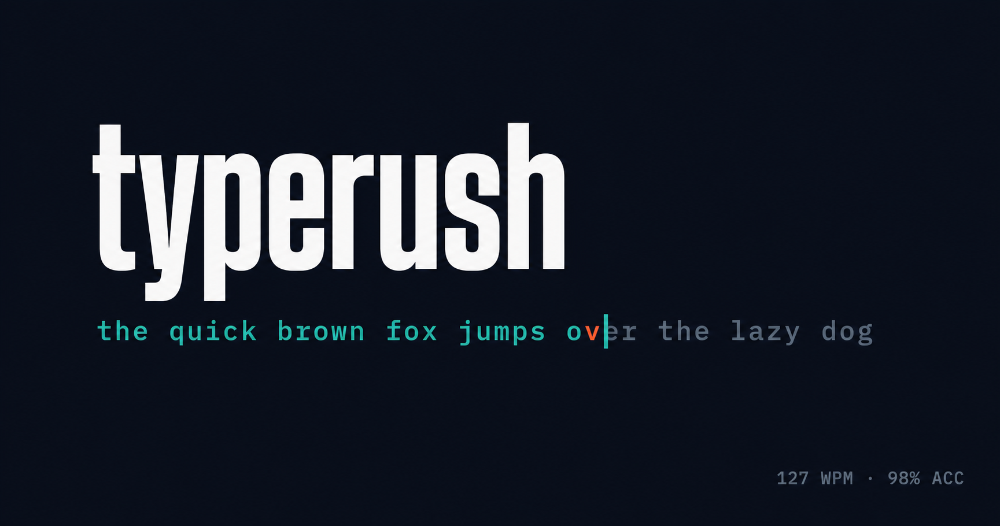

# typerush

A minimalist, fast typing speed test web app inspired by Monkeytype. Type randomly generated word sequences against a timer or word-count target, get real-time WPM, accuracy, and consistency stats, add friends and race them live, and level up via XP.

## Features

- Test modes — Time (15/30/60/120s), Words (10/25/50/100), Quote, Zen
- Live typing engine with per-character correctness highlighting, real-time WPM (raw + net), accuracy, and consistency
- Results screen — WPM, accuracy, consistency, char stats, per-second WPM graph, XP gained
- Auth + history — sign in with Google, GitHub, or email/password; save results, personal bests, race history, and XP
- Friends — search by username, send/accept friend requests, mutual friend list
- Races — live 1v1 typing races against a friend, synced in real time
- XP & leveling — every completed test earns XP toward an escalating level curve
- Streaks — daily current/longest typing streak tracked on your profile
- Profile stats — tests taken, total time typed, personal bests, recent tests, race history
- Data export — full account as JSON, or test-by-test results as CSV
- Leaderboard — global, filterable by mode and duration
- 40 color themes (20 dark, 20 light), persisted across sessions
- Settings — caret style, sound on click, blind mode, font

## Author

Ashutosh Swamy — [Portfolio](https://ashutoshswamy.in) · [GitHub](https://github.com/ashutoshswamy) · [LinkedIn](https://linkedin.com/in/ashutoshswamy) · [X](https://x.com/ashutoshswamy_) · [Ko-fi](https://ko-fi.com/ashutoshswamy)

## License

MIT — see [LICENSE](./LICENSE).
